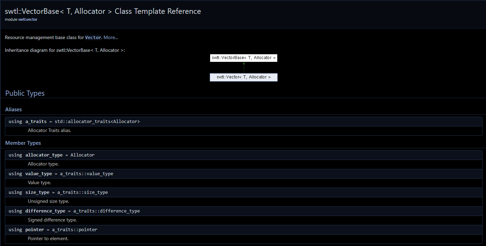

# Strictly Worse Template Library

The Strictly Worse Template Library is my learning playground for implementing C++ Standard Template Library components for the purpose of learning their internals.

# swtl::Vector

Currently working on an allocator aware clone of std::vector.

